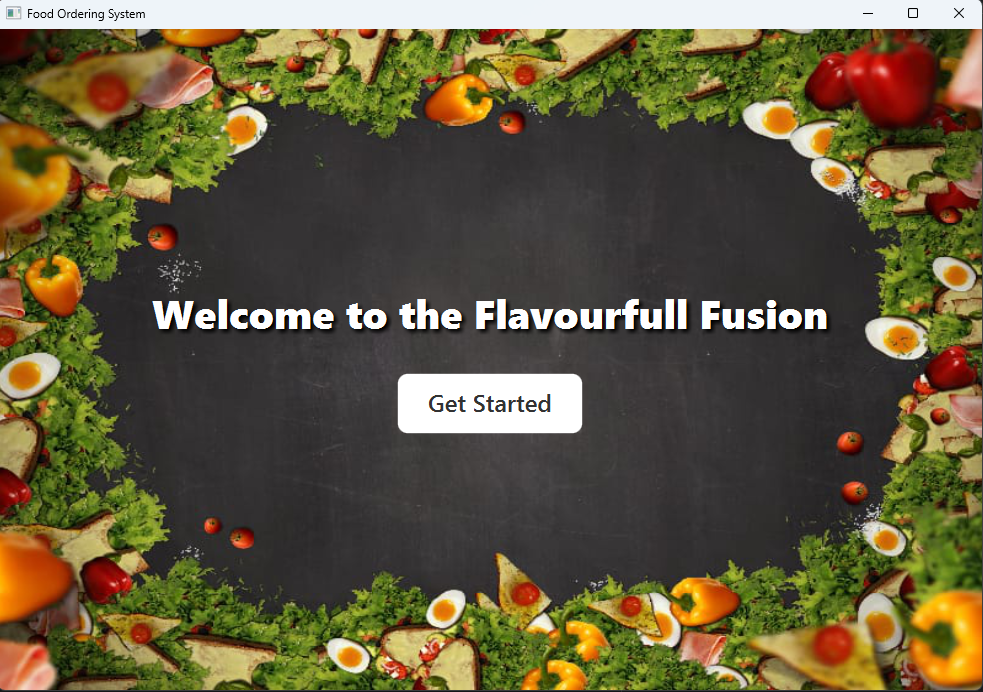
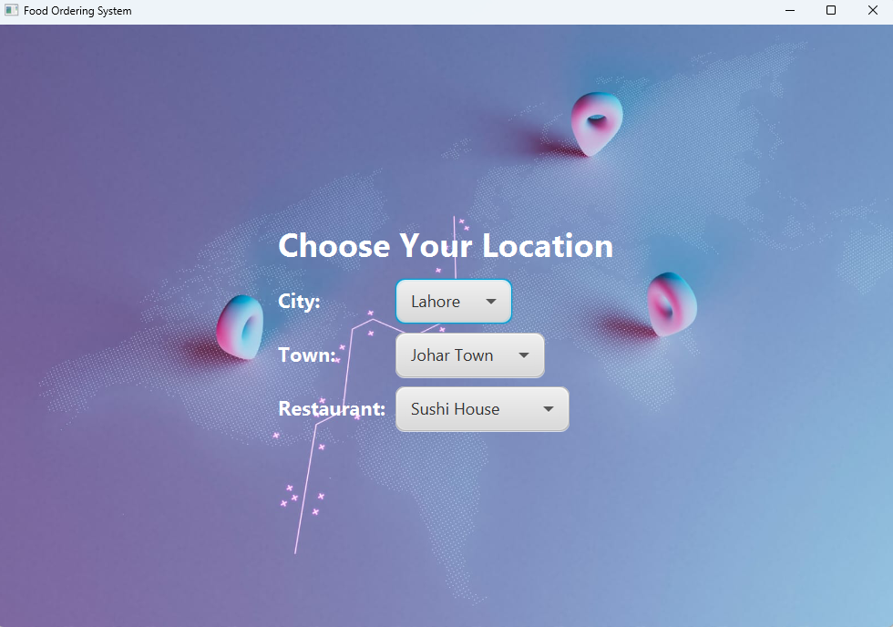
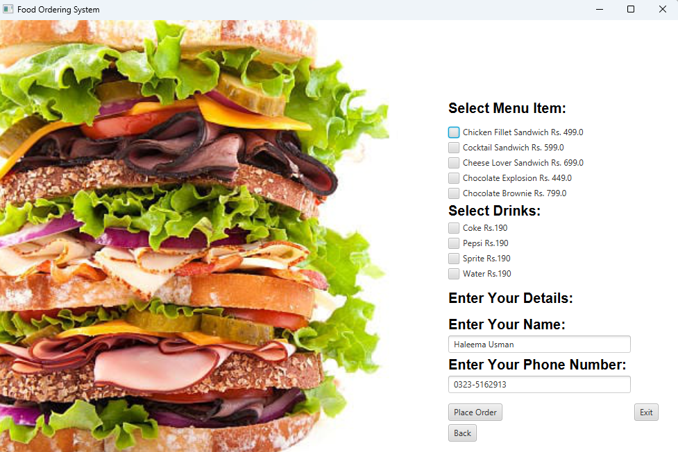
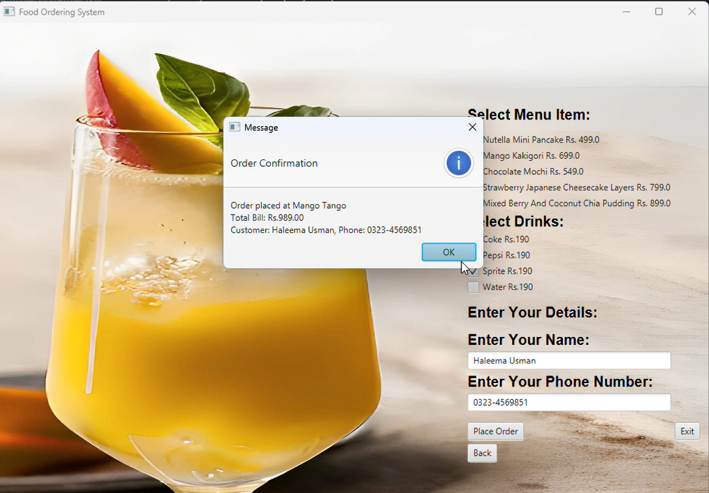
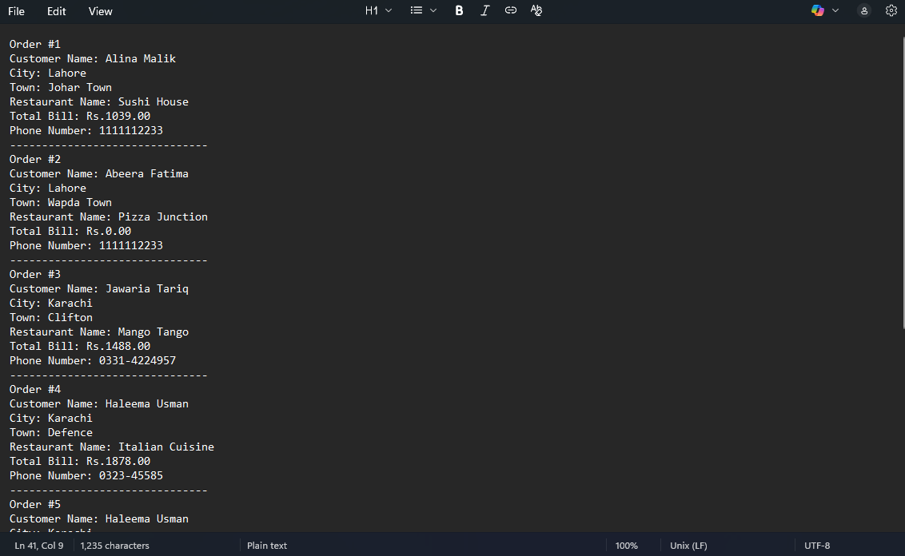

# 🍔 Food Ordering System

A desktop-based **Food Ordering System** developed using **Java 17** and **JavaFX** as a **second-semester university project**. The application provides an interactive graphical interface where users can select their location, browse restaurant menus, place food orders, and generate a bill.

---

## 📖 Overview

The Food Ordering System simplifies the food ordering process by allowing users to:

* Select their city and town
* Browse available restaurants
* View restaurant-specific menus
* Select food and drinks
* Enter customer information
* Generate a bill
* Save order details

The project demonstrates Object-Oriented Programming concepts and JavaFX GUI development.

---

## ✨ Features

* ✅ Interactive JavaFX graphical user interface
* ✅ Welcome screen
* ✅ City and town selection
* ✅ Location-based restaurant selection
* ✅ Restaurant-specific menus
* ✅ Food and drink selection
* ✅ Customer details form
* ✅ Automatic bill calculation
* ✅ Order confirmation dialog
* ✅ Save order details to a text file
* ✅ Back and Exit navigation

---

## 🛠 Technologies Used

* Java 17
* JavaFX
* IntelliJ IDEA
* Object-Oriented Programming (OOP)

---

## 📂 Project Structure

```text
Food-Ordering-System/
│
├── src/
│   └── main/
│       ├── java/
│       │   └── com/example/project3/
│       │       ├── Bill.java
│       │       ├── Customer.java
│       │       ├── HelloApplication.java
│       │       ├── Item.java
│       │       ├── Location.java
│       │       ├── Main.java
│       │       └── Restaurant.java
│       │
│       └── resources/
│           └── images/
│
├── screenshots/
├── README.md
└── .gitignore
```

---

## 🚀 How to Run

### Prerequisites

* Java 17
* JavaFX SDK
* IntelliJ IDEA

### Steps

1. Clone the repository.

```bash
git clone https://github.com/haleemausman1/Food-Ordering-System.git
```

2. Open the project in IntelliJ IDEA.

3. Configure the JavaFX SDK if required.

4. Run `HelloApplication.java`.

5. Start exploring the application.

---

## 🖥 Application Workflow

1. Launch the application.
2. Click **Get Started**.
3. Select a city.
4. Select a town.
5. Choose a restaurant.
6. Browse the menu.
7. Select food and drinks.
8. Enter customer details.
9. Click **Place Order**.
10. View the generated bill and order confirmation.

---

# 📸 Screenshots

## Welcome Screen



---

## Location Selection



---

## Restaurant Menu



---

## Customer Details & Order Form



---

## Order Confirmation & Bill



---

## 🎯 Learning Outcomes

This project helped strengthen understanding of:

* Object-Oriented Programming (OOP)
* JavaFX GUI Development
* Event-Driven Programming
* File Handling
* Collections Framework
* Application Design
* User Interface Development

---

## 🔮 Future Improvements

* Database integration
* User authentication
* Online payment system
* Order history
* Search and filtering
* Admin dashboard
* Improved user interface
* Enhanced input validation

---

## 👩‍💻 Author

**Haleema Usman**

Second Semester University Project

---

## 📄 License

This project was developed for educational purposes as part of a university semester project.
